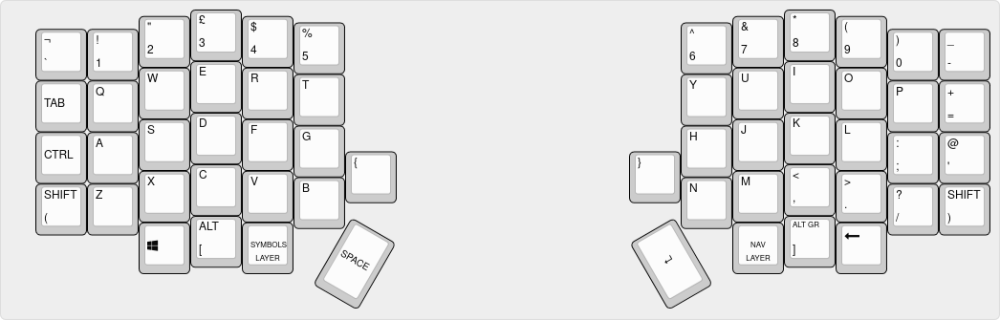
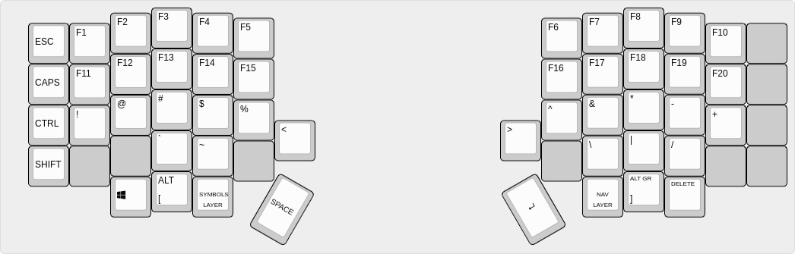

# Cbiscuit Layout for Lily58

> NOTE TO NEW READERS: This keymap is designed for people using UK keyboard
> layouts on their OS. It will work mostly the same for any other QWERTY layout,
> but some symbols may be different from the mapping images.

## Features

This repository is a keymap for the [Lily58](https://github.com/kata0510/Lily58)
series of ergonomic keyboards. It is intended to be a developer oriented keymap
with the following features:

### Space Cadet Keys

To provide easy access to commonly used symbols, the keymap uses QMK's
[Space Cadet Keys](https://github.com/qmk/qmk_firmware/blob/master/docs/feature_space_cadet.md).

| Key When Held | Key When Tapped |
|---------------|-----------------|
|`LEFT_SHIFT`   | `(`             |
|`RIGHT_SHIFT`  | `)`             |
|`LEFT_ALT`     | `[`             |
|`RIGHT_ALT`    | `]`             |

This should allow for devs to write a lot of code without having to hit SHIFT or
switch to a symbols layer to perform common code symbols.

Furthermore a few extra tweaks have been made to the default layer to minimize
layer switching:

* Dedicated curly bracket (`{` and `}`) keys.

### Up to 20 F-Keys

F1 to F12 are so standard. The symbol layer allows up to F20... if your
operating system supports them.

### Vim-style Navigation Layer

Arrow keys are mapped to `H`, `J`, `K`, `L` keys. To keep the theme, `Y`, `U`,
`I`, and `O` are mapped to the mouse horizontal and vertical scroll wheels, and
`N`, `M`, `,`, and `.` are mapped to home, pgdn, pgup and end respectively!

### Mouse Keys

The navigation layer includes keys for moving the mouse cursor, as well as keys
for left, middle and right click!

### Media Keys and Macros Layer

The MACROS layer brings support for media keys (including volume control) as
well as a limited set of macros (currently limited to power buttons). This layer
has a lot of empty spaces for you to define your own [QMK macros](https://github.com/qmk/qmk_firmware/blob/master/docs/feature_macros.md).

### Tap Or Hold Layer Keys

Hold layer keys to use keys on that layer briefly, or tap them twice to stay on
that layer until you want to switch back.

## Full Keymaps

The images below show the full keymaps for each supported layer. A printable
HTML file can be foumd [here](data/printable-keymap.html).

### Default Layer



### Symbols Layer



### Navigation Layer


### Macros Layer

The Macros layer is activated by pressing the Symbols and Navigation layer
keys simultaneously,


## Installation/Flashing

If you wish to try out this layout, follow these instructions:

### 1. Download/Install QMK

Follow the [instructions on the QMK website](https://docs.qmk.fm/#/newbs_getting_started)
to install QMK on your computer.

### 2. Install the Cbiscuit Module

Navigate to your `qmk_firmware` folder inside a terminal/command prompt window:


Then, use the following command to install the `cbiscuit` keymap:

```shell
git submodule add https://github.com/karlnicoll/lily58-cbiscuit.git keyboards/lily58/keymaps/cbiscuit
```

### 3. Flash Your Keyboard

The final step is to flash your keyboard. This is done the same way as in the
[lily58 build guide](https://github.com/kata0510/Lily58/blob/master/Pro/Doc/buildguide_en.md),
with a minor adjustment to use the correct keymap:

```shell
make lily58:cbiscuit:avrdude
```

Follow the on-screen instructions to complete flashing the keymap to your
keyboard.

Once finished, your keyboard will be running new firmware with the cbiscuit
keymap!

## License

This keymap is released into the public domain.
